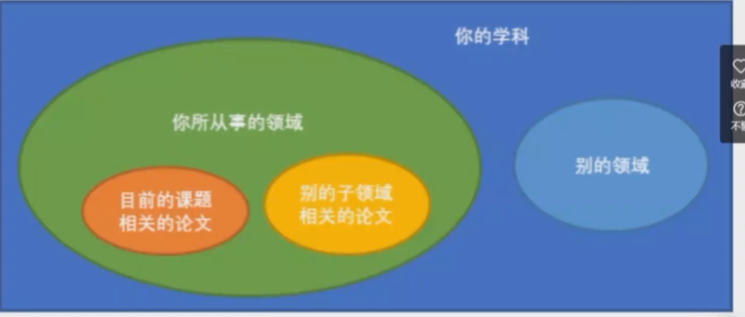

# paper_start --- bilibili

arxiv.org 提前把论文发出来，未经过评审。

黄色类型论文滤过

水文第一定律：标题越长，是水文的概率越大。

### 看标题识论文

+ 提出一个新的问题、质疑
+ 解决、分析一个问题
  + 方法：新方法、拼凑方法、迁移方法
  + 问题：方法的作用域

### 读论文

+ 摘要

  大部分论文看摘要即可

+ 简介

  有很多大道理，xxx，但是xxx没注意到什么。我解决了xxx

+ 相关工作

  如果不了解此领域，是一个优秀的综述

+ 方法

  细节比较多，如果不着急复现，可以不看

+ 实验

  用实践验证每个结论

+ 结论

  结论没用

### 文献管理

+ read q papers 

+ 收藏“不相关”论文

+ 整理列表，加标签，写备注。

+ 总结

  + 自己总结+ **阅读别人的综述** 

    找到别人的缺陷，针对缺陷去做改进

### 如何选题

浅谈研究生学位论文选题方法——刘洋

后续补充此部分

研究生要专注一个方向，深入下去不要东打一枪。

#### IDAE从哪里来

+ 要对领域有足够多的了解
+ 文献
  + 系统阅读文献，花一个下午把这个领域的论文通读一样，发现缺陷

方法

+ 排列组合式

+ 迁移式

+ 渐进式

#### 实验

+ 避免自己的主观偏见
  + 把任何实验现象都解释成符合自己预期的结论 ×
+ 控制变量法
  + 实验早期:一点点改变变量，避免过大的改进
  + 实验晚期：消融实验，证明每个部分的有效性。
+ MVP ——把某个部分去掉，发现效果下降了，说明是有效的。
  + 设计“验证试验”
    + 最小化可行产品
      + 要保证每一次都是可以运行的产品
    + 亚马逊的故事
      + 早起亚马逊用户下单购买书籍后，员工去书店购买再寄给用户，验证了卖书的想法是可行的。
  + 模拟试验
  + 采用替代方法

#### 

### 时间管理

| 重要 不紧急       | 重要 紧急       |
| ----------------- | --------------- |
| **不重要 不紧急** | **不重要 紧急** |

+ **优先安排不紧急但重要的事情**
+ 不重要但紧急的事情通过DDL解决
+ 碎片化时间解决优先度低的任务

#### 时间管理工具

+ Google calendar
+ window自带提醒事项
+ 提醒事项  Things  omnifocus
+ 任务安排 Notion Trello

+ 画图

  omnigraffle visio

